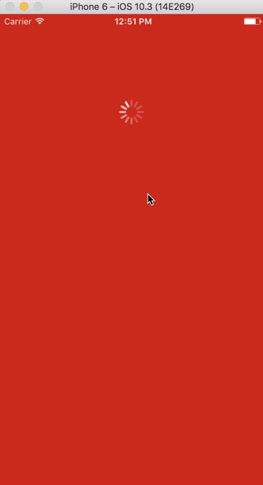

# React Native Starter Kit

Yet another starter kit for React Native. React Native Starter Kit helps you get started with React Native.

# Screenshot

# Benefits
- Easy to use
- Simple
- Easy to create a new project

# Features
- Authentication
- Navigation
- Sidebar
- Splash Screen

## Technologies

React Native Starter Kit combines the following technologies:

| Technology | Description |
| ---------- | ----------- |
| **React Native** | React Native lets you build mobile apps using only JavaScript. It uses the same design as React, letting you compose a rich mobile UI from declarative components. |
| **Native Base**  | NativeBase is an open source framework to build React Native apps over a single JavaScript codebase for Android and iOS. |
| **Redux**  | Redux is a predictable state container for JavaScript apps. |
| **Flow** | Flow is a static type checker for avascript |
| **Eslint** | A pluggable and configurable linter tool for identifying and reporting on patterns in JavaScript. Maintain your code quality with ease. |

[Read the Documentation →](https://github.com/bahattincinic/react-native-starter-kit/wiki)

## Deployment
Read the [wiki](https://github.com/bahattincinic/react-native-starter-kit/wiki) to learn how to deploy the application

## Contributing
If you find any problems, please open an issue or submit a fix as a pull request.

## Licence

MIT License

Copyright (c) 2017 Bahattin Çiniç

Copyright (c) 2017 Burak Alkan

Permission is hereby granted, free of charge, to any person obtaining a copy
of this software and associated documentation files (the "Software"), to deal
in the Software without restriction, including without limitation the rights
to use, copy, modify, merge, publish, distribute, sublicense, and/or sell
copies of the Software, and to permit persons to whom the Software is
furnished to do so, subject to the following conditions:

The above copyright notice and this permission notice shall be included in all
copies or substantial portions of the Software.

THE SOFTWARE IS PROVIDED "AS IS", WITHOUT WARRANTY OF ANY KIND, EXPRESS OR
IMPLIED, INCLUDING BUT NOT LIMITED TO THE WARRANTIES OF MERCHANTABILITY,
FITNESS FOR A PARTICULAR PURPOSE AND NONINFRINGEMENT. IN NO EVENT SHALL THE
AUTHORS OR COPYRIGHT HOLDERS BE LIABLE FOR ANY CLAIM, DAMAGES OR OTHER
LIABILITY, WHETHER IN AN ACTION OF CONTRACT, TORT OR OTHERWISE, ARISING FROM,
OUT OF OR IN CONNECTION WITH THE SOFTWARE OR THE USE OR OTHER DEALINGS IN THE
SOFTWARE.
